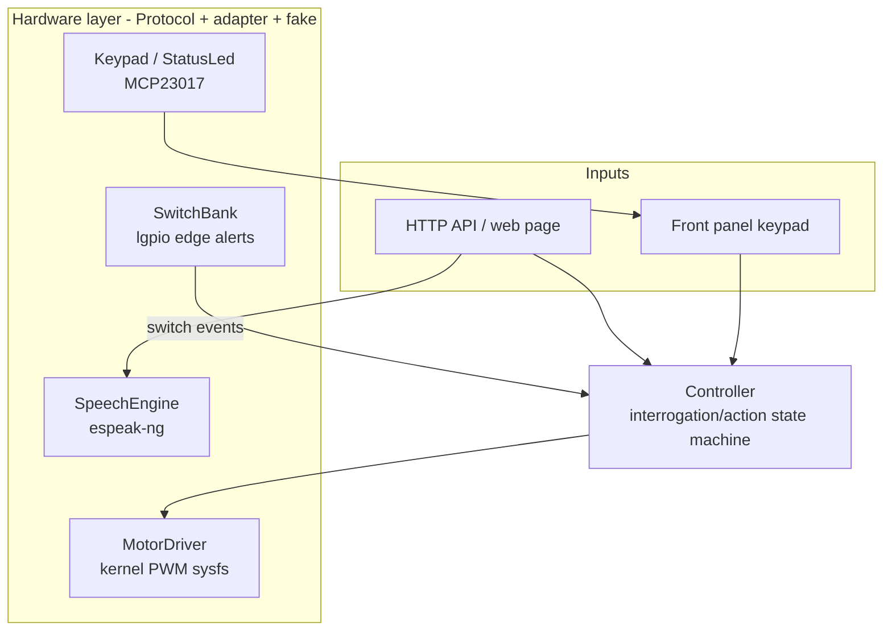
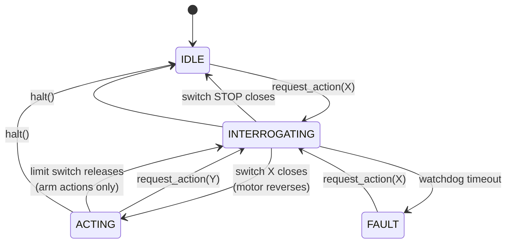

# Theory of Operation

How a 1984 Tomy Verbot works, what replaced its original electronics, and how
the software drives it.

The whole system rests on one fact about the toy: **Verbot has a single motor,
and its direction selects between two entirely different modes of operation.**
Everything else — the state machine, the API, the watchdog — follows from that.

---

## 1. The mechanism

A single bi-directional 3 V DC motor drives a planetary gear set. Motor polarity
chooses the mode:

| Motor direction | Mode | What happens |
|-----------------|------|--------------|
| Anti-clockwise | **Interrogation** | A cam drum rotates, closing eight switches in a fixed repeating order. The robot does not visibly move. |
| Clockwise | **Action** | A clutch engages, the drum stops, and the gear set at whichever switch is closed performs its action. |

### Interrogation

The drum carries eight cams spaced around its circumference. As it turns, each
cam closes and then releases one of eight normally-open switches, always in the
same sequence:

> stop → rotate right → rotate left → forwards → reverse → put down → pick up → talk

The switches complete a circuit to ground, so the Pi reads them as GPIO inputs
with pull-ups: **closed reads LOW**. Interrogation is purely a selection phase —
it is the robot deciding *which* gear to engage, not doing anything.

### Action

Reversing the motor engages the clutch. The drum stops where it is, leaving the
last-selected switch held closed, and a shaft inside the drum begins to turn.
The planetary gear set at that position performs its action.

Two things follow, and they are the source of most of the software's design:

- **The selected switch stays closed for the duration of the action**, because
  the drum has stopped on its cam.
- **Nothing stops the action on its own.** The gear set runs until the motor is
  reversed again.

The exception is the two arm actions. `pick_up` and `put_down` have mechanical
**limit switches wired in series**. When an arm reaches the end of its travel
the circuit breaks — so the controller sees the switch *release* while the
action is running, and takes that as "finished". Without it the mechanism
strains against its own stop.

So the complete recipe for performing action X is:

> Run the motor anti-clockwise until switch X closes, then immediately reverse.

Full mechanical detail, the ribbon-cable colour map and the original power
arrangement are in [`hardware.md`](hardware.md).

---

## 2. The electronics

The original 1980s control board is removed. The motor, gearbox, interrogation
switch bank and front keypad are retained and driven directly from the Pi.

| Part | Role | Notes |
|------|------|-------|
| **Raspberry Pi Zero 2 W** | Everything | 64-bit Raspberry Pi OS (Trixie) |
| **DRV8833** carrier | Motor driver | Replaces the original polarity-reversing circuit |
| **MAX98357A** | I2S DAC + amplifier | Speech output to a passive 4–8 Ω speaker |
| **MCP23017** | I2C GPIO expander | The eight front-panel buttons and the status LED |
| **Pimoroni OnOff SHIM** | Power button, clean shutdown | Owns BCM 4, 17, 27 |
| USB power bank | 5 V supply | The original 3 V and 6 V battery rails are gone |

Three deliberate choices are worth knowing, because they constrain everything
else:

**Motor PWM is kernel-managed, not pigpio.** The DRV8833 has no PHASE/ENABLE
mode, so direction is expressed by *which* of `IN1`/`IN2` carries the PWM while
the other sits low — meaning both inputs need their own PWM channel
(`dtoverlay=pwm-2chan` on BCM 12 and 13). pigpio would need the PCM peripheral
for DMA timing, and the I2S DAC needs PCM too. Kernel PWM has no such conflict,
so this robot gets both hardware PWM *and* audio. The original project had to
give up hardware PWM for exactly this reason.

**The eight interrogation switches are direct GPIO inputs**, edge-triggered via
`lgpio` with internal pull-ups. They are not on the expander — latency matters
for catching a cam as the drum sweeps past.

**The front panel is on I²C**, because eight more direct GPIOs were not
available. This is the one part that is not latency-critical: it is polled.

Pin assignments are in [`hardware.md`](hardware.md#gpio-assignments-this-project);
the schematic is at [`../hardware/verbot-schematic.pdf`](../hardware/verbot-schematic.pdf).

---

## 3. The software

Four layers, each testable without a Raspberry Pi:



**The hardware layer** is a set of `Protocol` classes in
`hardware/protocols.py` — `MotorDriver`, `SwitchBank`, `Keypad`, `StatusLed`,
`SpeechEngine`, `SystemPower`. Each has a real adapter and an in-memory fake.
`VERBOT_USE_REAL_HARDWARE=false` (the default) selects the fakes, which is why
the entire test suite runs on any machine.

**The controller** (`controller.py`) is the state machine and owns all robot
behaviour. It is the only thing that talks to the motor.

**The API** (`api.py`) is a thin FastAPI layer. It validates and delegates; it
holds no robot logic.

**The front panel feeds the same funnel.** The keypad's listener signature is
exactly `controller.request_action`, so a button press and an HTTP request are
indistinguishable downstream — and the panel keeps working with no network.

### The state machine



Requesting an action sets the motor to `+interrogation_speed` and starts a
watchdog. Two switch events matter, and the mode disambiguates them:

- `INTERROGATING` + **closed** + it is the one we want → the gears are in
  position; reverse to `action_speed`.
- `ACTING` + **released** + it is the action we are running → a limit switch
  broke the circuit; the action is finished, so park at the stop cam.

Everything else is the drum sweeping past, and is ignored.

**The watchdog guards interrogation only.** If the expected switch never
arrives within `interrogation_timeout_s`, the controller stops the motor and
enters `FAULT` — this is what stops the robot grinding away when a switch is
mis-wired. There is deliberately **no timeout on `ACTING`**, because a running
action is supposed to continue until commanded otherwise. For `forwards` and
friends that means the operator ends it; only the arm actions stop themselves.

### Two ways to stop

These are different operations and the distinction matters:

| | Endpoint | Effect |
|---|---|---|
| **Halt** | `POST /halt` | Motor off immediately. Drum left wherever it is, position unknown. |
| **Stop** | `POST /actions/stop` | Interrogates round to the stop cam and parks there, then off. |

`/halt` is the emergency control — it is what the oversized red button on the
web page calls, and what runs before a shutdown. `/actions/stop` is the tidy
one: it homes the mechanism so the next interrogation starts from a known
position.

### Speech

`espeak-ng` is deliberate: tiny, no model files, comfortable on a Zero 2 W, and
its clipped synthetic voice suits a 1984 toy far better than a neural TTS would.
Calls are serialised behind a lock — one sound card, one voice at a time.

Speaking can optionally drive the mouth. `POST /say` with `animate: true`
interrogates for `TALK`, **waits until the gear is actually engaged**, speaks,
then parks at the stop cam. The wait matters: interrogation takes seconds, so
starting the phrase when the request is accepted would play the audio before the
mouth moved. If the gear never engages the failure is logged and the phrase is
spoken anyway — the audio is the point, and refusing to speak because the
gearbox is absent would make the speaker untestable.

---

## 4. The API

Interactive docs are served at `/docs`, and a control page for bring-up at `/`.

| Method | Path | Purpose |
|--------|------|---------|
| `GET` | `/` | Web control page: buttons, status, speak box, speed sliders, log, and shutdown when configured |
| `GET` | `/healthz` | Liveness. `{"status": "ok"}` |
| `GET` | `/status` | Current `mode`, `current_action`, `desired_action` |
| `POST` | `/actions/{action}` | Interrogate for `action`, then perform it |
| `POST` | `/stop` | Park the drum at the stop cam |
| `POST` | `/halt` | Cut the motor now, without interrogating |
| `POST` | `/say` | Speak text, optionally animating the mouth |
| `GET` | `/speeds` | Current interrogation and action speeds |
| `PATCH` | `/speeds` | Adjust either speed live (not persisted) |
| `POST` | `/system/shutdown` | Power off. Registered **only** when a token is configured |

`{action}` is one of `stop`, `rotate_right`, `rotate_left`, `forwards`,
`reverse`, `put_down`, `pick_up`, `talk`. It is typed as an enum, so an unknown
action is a `422` rather than a silently ignored request.

Action endpoints return `202 Accepted` with the controller status: they return
once the motor *starts*, not once the action completes. Poll `/status` to follow
progress.

```bash
curl -s localhost:8080/status
curl -X POST localhost:8080/actions/pick_up
curl -X POST localhost:8080/halt
curl -X POST localhost:8080/say \
  -H 'content-type: application/json' \
  -d '{"text": "I am Verbot", "animate": true}'
curl -X PATCH localhost:8080/speeds \
  -H 'content-type: application/json' \
  -d '{"interrogation_speed": 40}'
```

The robot advertises itself over mDNS as `verbot.local`, so the API is reachable
without knowing its address.

### Shutdown

`/system/shutdown` exists only if `VERBOT_SHUTDOWN_TOKEN` is set — the default
deployment has no such route at all, rather than a route that always refuses. It
requires the token in an `X-Verbot-Token` header, halts the motor before the
machine goes, and returns `202` from a background task so the response outlives
the poweroff.

The web page grows a **Shut down the Pi** control when the token is configured,
and omits it entirely otherwise. The token is deliberately **not** served in the
page: the page itself is unauthenticated, so embedding it would hand poweroff to
anyone on the LAN and undo the reason the endpoint is guarded at all. Instead
the browser asks once and keeps it in `localStorage`, and forgets it again on a
401.

---

## 5. Configuration

Every setting is an environment variable prefixed `VERBOT_`, readable from a
`.env` file in the working directory. The ones that change behaviour most:

| Variable | Default | Effect |
|----------|---------|--------|
| `VERBOT_USE_REAL_HARDWARE` | `false` | **`true` on the robot.** False runs entirely on fakes and nothing moves. |
| `VERBOT_KEYPAD_ENABLED` | `true` | `false` skips the MCP23017 entirely — useful before it is wired |
| `VERBOT_INTERROGATION_SPEED` | `50` | Drum speed. Slower gives more reliable switch detection. |
| `VERBOT_ACTION_SPEED` | `-100` | Negative by convention. Cap it if `VCC` is 5 V — the motor is a 3 V part. |
| `VERBOT_INTERROGATION_TIMEOUT_S` | `10.0` | Watchdog. Roughly double a full drum revolution. |
| `VERBOT_STARTUP_ANNOUNCEMENT` | `"I am Verbot! …"` | Spoken once ready. Empty to stay silent. |
| `VERBOT_SHUTDOWN_TOKEN` | unset | Setting it registers `/system/shutdown` |

Speeds are signed: **positive is interrogation, negative is action.** If the
motor turns the wrong way, swap `OUT1` and `OUT2` rather than the signs in the
code.

---

## Further reading

- [`hardware.md`](hardware.md) — pin assignments, ribbon colours, wiring warnings
- [`deployment.md`](deployment.md) — flashing, first boot, install, bring-up checklist
- [`../hardware/verbot-schematic.pdf`](../hardware/verbot-schematic.pdf) — full schematic
